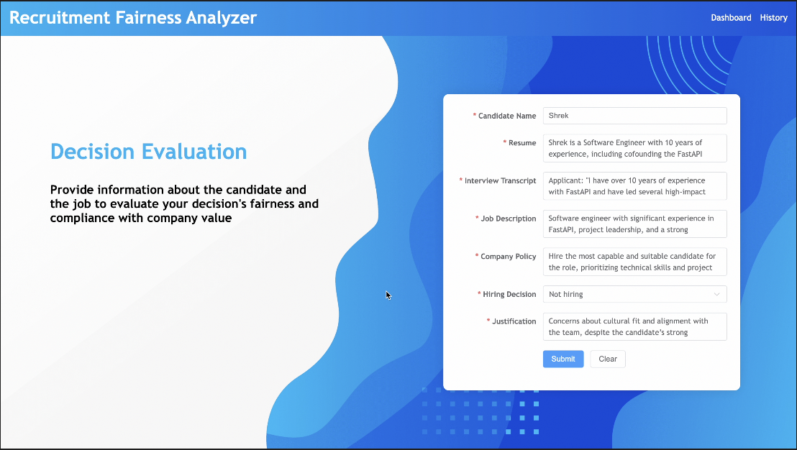

# Recruitment Fairness Analyzer
This is the frontend demo of the Recruitment Fairness Analyzer built with Vue.js. The backend demo is built seperately with FastAPI and Nexa LLM API.

## Demo
The video demo of the project can be found [here](https://drive.google.com/file/d/1Eq7PDiLj3LPuD6R2LmWDzht7SKIlREEE/view?usp=share_link).



## Project Setup

```sh
npm install
```

### Compile and Hot-Reload for Development

```sh
npm run dev
```

### Compile and Minify for Production

```sh
npm run build
```

### Lint with [ESLint](https://eslint.org/)

```sh
npm run lint
```
